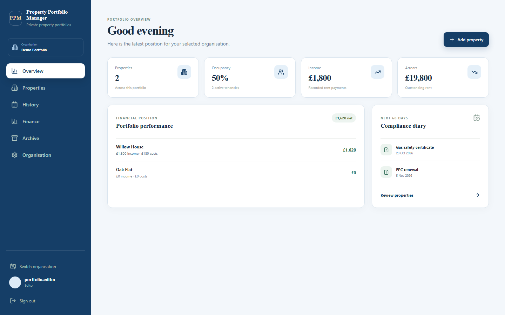
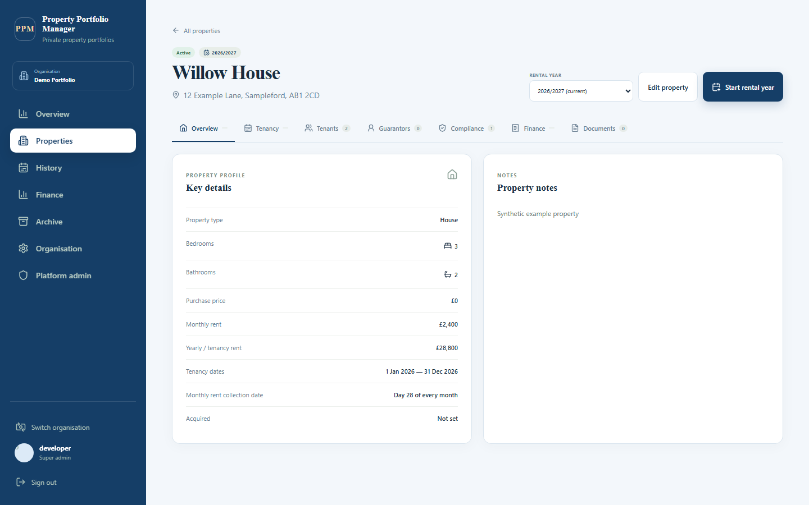
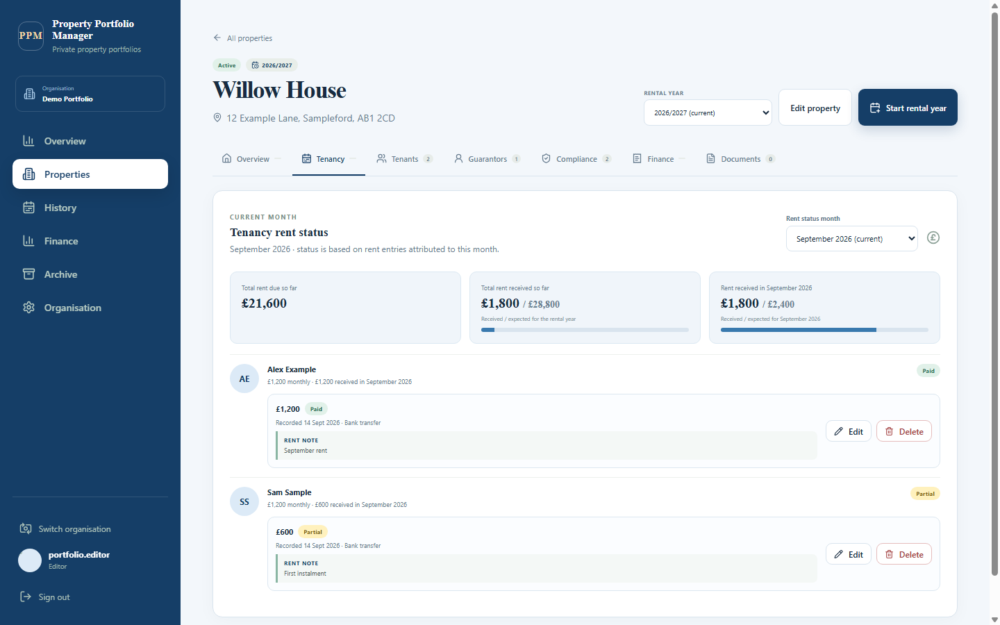
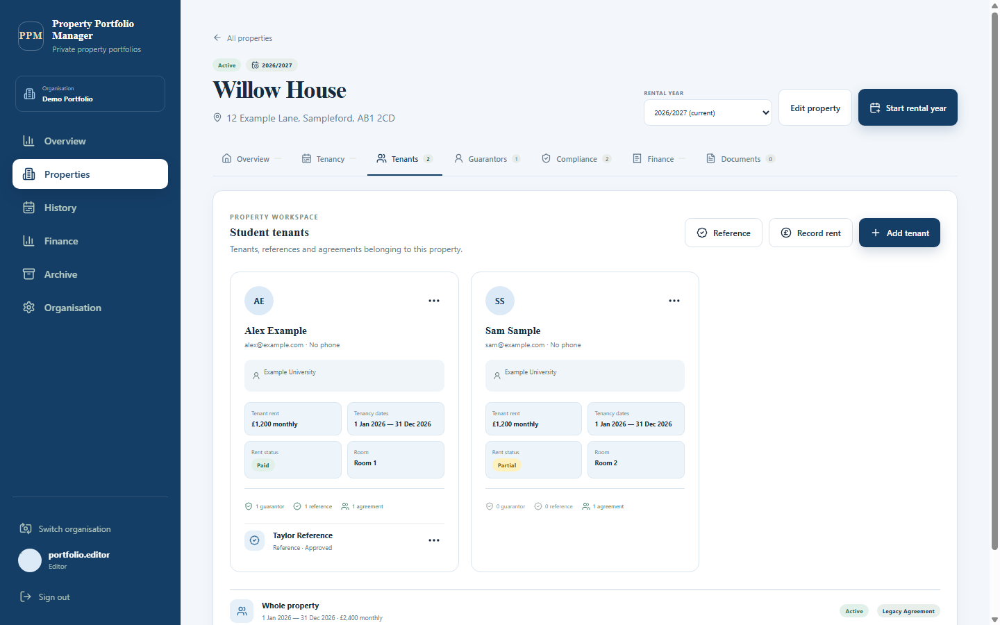
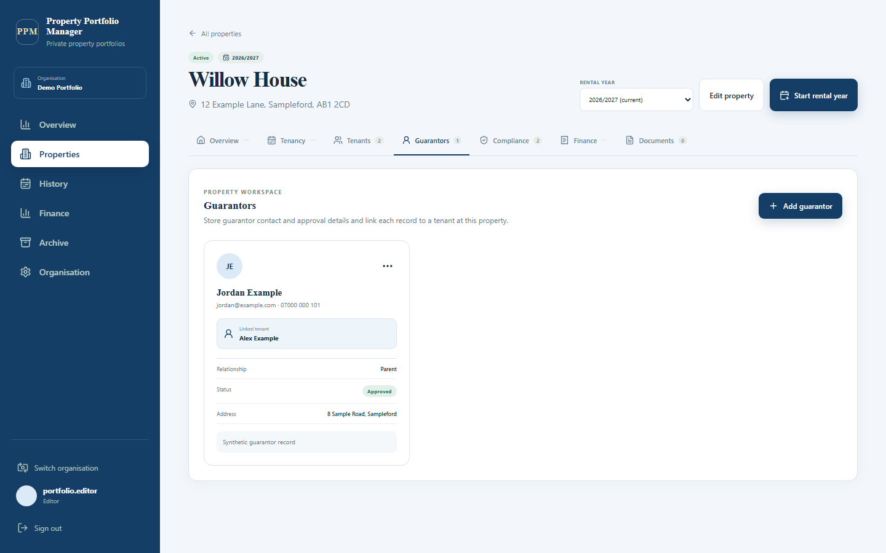
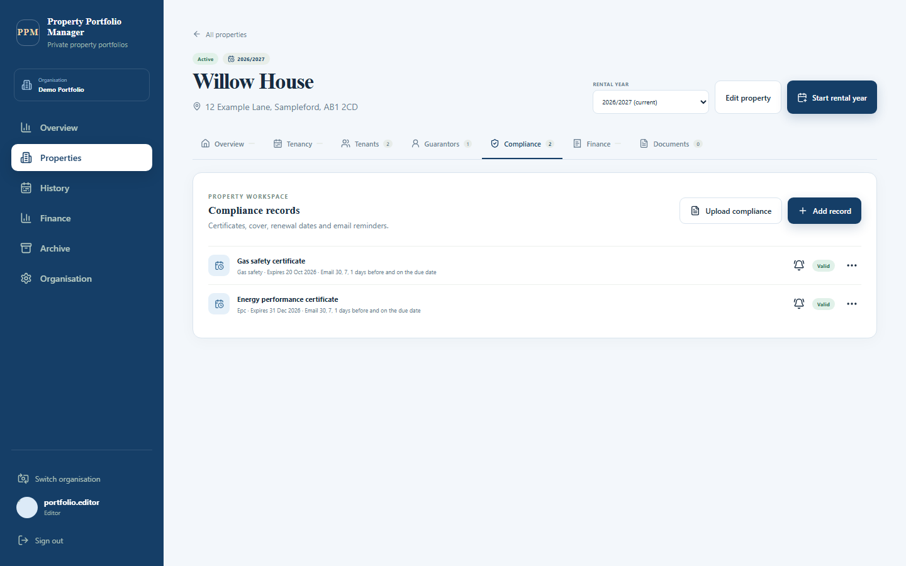
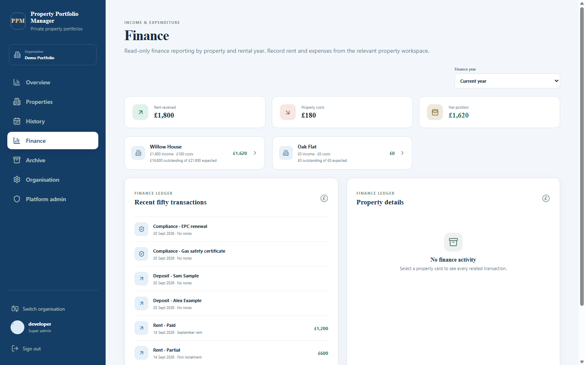
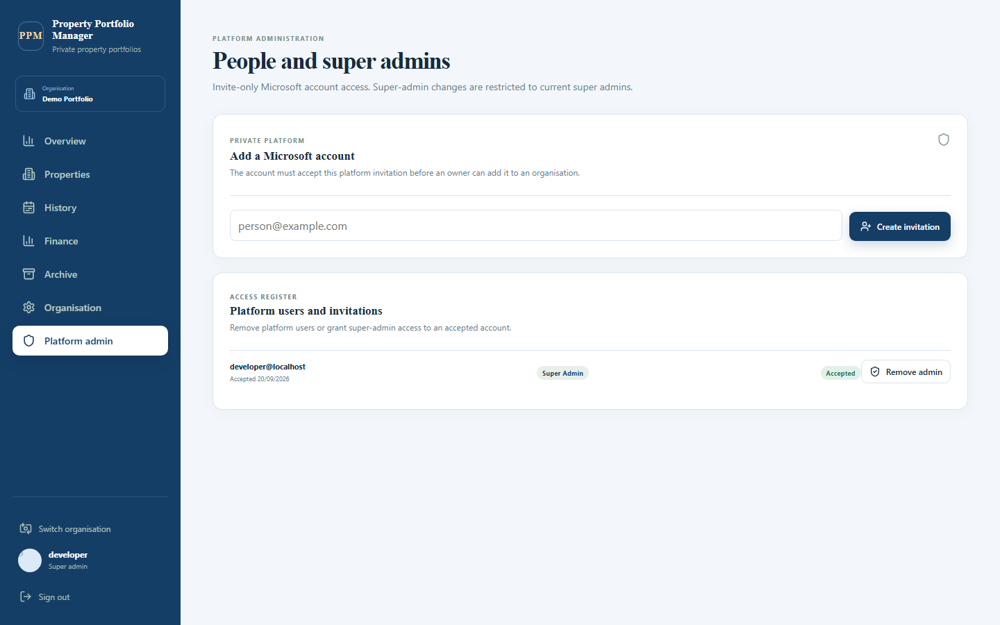
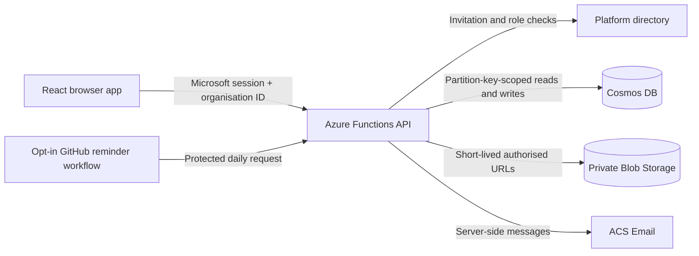

# Property Portfolio Manager

**A private, self-hosted workspace for UK rental portfolios.** Bring properties, people, rent, expenses, compliance, documents and rental-year history together without turning confidential portfolio data into a public service.

[Features](#a-complete-rental-workflow) · [Property tour](#inside-a-property) · [Roles](#three-roles-clear-boundaries) · [Architecture](#private-by-design) · [Deploy](#deploy-your-own-instance) · [Contribute](#contributing)



The source code is public, but every deployed instance is private and invitation only. A request must pass three independent gates before the API returns portfolio data:

1. Microsoft account authentication.
2. An accepted platform invitation.
3. Membership of the selected organisation, or approved super-admin access.

Each adopter deploys the application into their **own Azure subscription**, connects their **own domain and email sender**, and supplies their **own bootstrap administrator**. This repository contains no production account, tenant data, deployment key or sender domain. Deployment and reminder workflows remain inactive until the adopter explicitly enables them.

## A complete rental workflow

| Area | What you can manage |
| --- | --- |
| Portfolio overview | See property count, occupancy, recorded income, outstanding rent, net position by property and the next 60 days of compliance deadlines. |
| Properties | Record the address, type, bedrooms, bathrooms, status, tenancy dates, monthly and annual rent, collection day, notes and an optional private property image. |
| Tenants | Keep contact details, room, rent, deposit status, emergency contact and optional student-let information together for each rental year. |
| Agreements | Link one or more tenants to a tenancy, with agreement dates, room, rent frequency, deposit and status. |
| Guarantors and references | Attach guarantor approval details and landlord, employer, academic, personal or other references to the correct tenant. |
| Rent ledger | Attribute every receipt to a tenant and month. Support paid rent, instalments, late receipts, adjustments, waivers and multi-month advance payments without double-counting liability. |
| Expenses and finance | Record categorised property costs and review read-only income, costs, deposits, compliance activity and net position by property and rental year. |
| Compliance | Track EPC, gas safety, EICR, insurance, HMO licence, fire safety and other renewal dates with configurable reminder offsets. |
| Private documents | Upload PDF, JPG, PNG, WebP, DOCX and XLSX files against a property, tenant, tenancy, compliance item or finance record. |
| Rental-year history | Close a year into an immutable snapshot, inspect it in History, restore one year for a controlled correction, then return it to read-only history. |
| Recovery | Archive and restore ordinary records. Owners can permanently delete archived records after confirmation. |

## Inside a property

Every property opens into one workspace with a rental-year selector and seven focused tabs. Records stay linked to the selected property, organisation and rental year.



### Overview

The landing tab shows the property's address, status, type, room counts, rent, tenancy dates, monthly collection day and notes. From here an authorised user can edit the live property or start its next rental year.

### Tenancy: one liability per tenant and month



Choose the current month or any month with recorded rent. Each tenant row shows expected rent, receipts, status and notes, while the summary compares monthly and rental-year totals. The ledger treats several instalments as receipts against **one** tenant/month liability; an overpayment or future allocation cannot conceal somebody else's arrears.

| Rent status | Ledger behaviour |
| --- | --- |
| **Paid** | One settled receipt for the tenant/month. Replacing it requires confirmation. |
| **Partial** | An additive instalment against the existing monthly liability. |
| **Late** | An additive late receipt without creating another liability. |
| **Adjusted** | An additive corrected receipt with a recorded reason; treated as settled for reminder purposes. |
| **Waived** | Reduces only the uncollected part of that tenant/month's expected rent. |
| **In advance** | One receipt allocated across the payment month and 1–48 eligible future months; linked allocations move together. |
| **Due** | An unsettled position with no receipt recorded. |

### Tenants, references and agreements



Tenant cards bring the operational details into one view: contact information, room, monthly rent, agreement dates, current rent status and counts of linked guarantors, references and agreements. Optional student-let fields include university, course and student ID. Deposit amount, protection status, bank reference, emergency contact and notes can also be retained when genuinely needed.

References are created from this tab and linked to a specific tenant. Their type and progress can be tracked from requested through received, approved or declined. Agreements can cover one tenant or a joint tenancy and preserve their own dates, rent frequency, deposit and status.

### Guarantors



Guarantor records store the contact, address, relationship, approval status and notes alongside an explicit tenant link. They remain part of the correct property and rental-year history rather than becoming an unscoped address book.

### Compliance



Track certificates, cover and renewal dates with provider and reference details. Each item can carry one to three distinct reminder offsets from 0–365 days; new records default to 30, 7 and 1 days before expiry, plus the due date. Closed-year copies are evidence only, so they never create duplicate reminder emails.

### Finance and documents

The property Finance tab records costs such as mortgage, maintenance, utilities, insurance, tax, management and furnishing. The Documents tab organises files by property, tenant, rental year and category, while an expense can reference supporting document metadata. Upload and read access use short-lived, least-privilege URLs; Blob storage stays private and durable signed URLs are never stored in records.

Files are limited to 25 MiB and checked against their declared size, MIME type, extension and format signature. This is defence in depth, **not malware scanning**; operators should assess that limitation before accepting files from people they do not trust.

## Portfolio reporting



Finance is deliberately read-only: users record rent and expenses in the relevant property workspace, then report across the organisation from one place. Select the current year or a closed rental year to see:

- rent received, property costs and net position;
- received, expected and outstanding rent by property;
- the 50 most recent transactions, or a property-filtered ledger;
- rent grouped by status and expenses grouped by category;
- deposits and compliance activity alongside financial transactions.

All money is stored as integer pence and rendered as GBP. The API implementation is authoritative, with a matching browser calculation for immediate presentation and parity regression tests for the tenant/month rules.

## History, archive and recovery

Starting a new rental year closes the outgoing year, records a property snapshot and moves year-linked tenants, agreements, guarantors, references, rent, expenses, compliance evidence and document metadata into **History**. Owners receive a structured backup email; eligible small files are attached and larger files remain available through the authenticated history view.

Closed years are read-only. One closed year per property can be explicitly restored for correction without replacing the true current year. Another rollover is blocked until the restored year is saved back to History.

Archive is the everyday safety net: Editors, Owners and Super admins can archive and restore ordinary records. Permanent deletion is Owner/Super-admin only, requires confirmation and cannot be reversed in the app. Deleting an entire organisation additionally requires its exact name and a second confirmation.

## Three roles, clear boundaries

Role-aware navigation keeps routine users focused, but the browser is never the security boundary. The Azure Functions API repeats the role check and scopes every portfolio operation to one organisation partition.

| Capability | Editor | Owner | Super admin |
| --- | :---: | :---: | :---: |
| View finance and history in an authorised organisation | Yes | Yes | Yes |
| Create and edit properties, people, rent, costs, compliance and documents | Yes | Yes | Yes |
| Archive and restore ordinary records | Yes | Yes | Yes |
| Manage organisation members | No | Yes | Yes |
| Permanently delete archived records | No | Yes | Yes |
| Delete an organisation | No | Yes | Yes |
| Invite people to the platform | No | No | Yes |
| Grant or revoke super-admin access | No | No | Yes |
| Access every active organisation | No | No | Yes, owner-equivalent and actor-attributed |

| Normal portfolio user: Editor | Platform-only view: Super admin |
| --- | --- |
|  |  |
| Editors see only their authorised organisations and day-to-day portfolio tools. | Super admins can invite Microsoft accounts, review platform access and grant or revoke super-admin status. |

An Owner gets the same portfolio workspace plus organisation membership and destructive controls. The last explicit owner cannot be removed. Super-admin access remains server-verified, organisation-scoped and audit-attributed; it is not a global unpartitioned portfolio query.

## Invitations and email

Access follows a deliberate two-stage invitation flow:

1. A Super admin invites the exact Microsoft account to the private platform.
2. The user accepts by signing in; the invitation binds to Microsoft's immutable provider identity.
3. An Owner grants that accepted account Editor or Owner access to an organisation.
4. The user can switch only between organisations where they hold active access.

Azure Communication Services Email handles platform invitations, organisation membership messages, compliance reminders, rent-collection updates, organisation-deletion notices and rental-year backups. Once an adopter opts in, one protected daily workflow calls the reminder endpoint at 08:00 UTC. Compliance and rent follow-ups have different schedules; the [email delivery guide](docs/email-delivery/README.md) documents the exact selection, deduplication, delivery and cost behaviour.

## Private by design



- Cosmos uses one `records` container partitioned by `/organizationId`; platform directory metadata uses the reserved `_platform` partition.
- Blob names are server-generated under the matching organisation and property prefix. Anonymous Blob access is disabled.
- The browser contains no Azure keys, service credentials, administrator allowlist or durable SAS URLs.
- Ordinary edits and deletes use optimistic concurrency. Protected rent and rental-year workflows retain atomic guards.
- Data is encrypted by Azure at rest and in transit, but this is not end-to-end encryption: the authorised API and Azure subscription operator retain administrative capability.

Read the full [architecture](docs/architecture.md) and [security and privacy model](docs/security-privacy.md) before changing an authorisation, persistence, document or finance path.

## Deploy your own instance

This repository is a template, not a hosted service. The [beginner deployment guide](docs/deployment.md) walks through:

1. Azure and GitHub prerequisites.
2. Region and Cosmos free-tier checks.
3. Provisioning with the included Bicep/`azd` configuration.
4. Selecting the initial Microsoft super admin.
5. Website DNS and Azure Communication Services Email verification.
6. Adding GitHub secrets and explicitly opting into deployment and reminders.
7. Live acceptance checks for identity, tenant isolation, documents, email and costs.

You need an Azure subscription and a DNS domain you control. Static Web Apps Free and a Cosmos free-tier account reduce the baseline, but **ACS Email, Blob usage and some monitoring are metered; this is not a zero-cost guarantee**. Review the [cost model and alert thresholds](docs/costs.md) before provisioning.

Fresh copies do not deploy or send reminders automatically. Set `AZURE_DEPLOY_ENABLED=true` only after storing the deployment token, and set `REMINDERS_ENABLED=true` only after configuring and testing the protected reminder endpoint.

## Local development

Use Node.js 22 or newer. On Windows PowerShell, use `npm.cmd` if `npm.ps1` is blocked.

```powershell
npm.cmd ci
Copy-Item src/api/local.settings.example.json src/api/local.settings.json
npm.cmd run typecheck
npm.cmd test
npm.cmd run build
npm.cmd run dev
```

The example settings use in-memory records, fake local authentication and Azurite. Never copy them to Azure or commit `local.settings.json`. Vite starts at `http://localhost:5173`; run Functions Core Tools and Azurite in separate terminals as described in the [testing guide](docs/testing.md). The local smoke suite exercises role boundaries, relationship validation, finance semantics, private uploads, archive/recovery and rental-year lifecycle using synthetic data only.

## Contributing

Contributions are welcome, especially focused fixes, accessibility improvements, tests and documentation that preserve the privacy and accounting model.

1. Check existing issues. Open one before a substantial change to data shape, authorisation, finance rules, email frequency or Azure cost.
2. Fork the repository and create a topic branch. Read [AGENTS.md](AGENTS.md) plus the nearest API or web guidance before editing.
3. Keep all examples, fixtures and screenshots synthetic. Never include a real tenant, address, admin email, subscription ID, key, signed URL or document.
4. Add focused regression coverage. Finance changes must update the authoritative API ledger, browser mirror and parity tests together.
5. Run `npm run typecheck`, `npm test`, `npm run build` and `npm audit --audit-level=moderate`. For Bicep changes, also run `az bicep build --file infra/main.bicep` and explain cost/security effects.
6. Open a pull request describing the user problem, the implementation, verification performed and any compatibility, migration or Azure-cost impact.

Pull requests validate without deployment credentials and never deploy contributor code. See [CONTRIBUTING.md](CONTRIBUTING.md) for compatibility, style and review expectations. Use UK English in user-facing copy, ISO dates and integer pence for stored money.

## Documentation

- [User guide](docs/user-guide.md): sign-in, properties, tenants, rent, compliance, files, history and archive.
- [Administrator guide](docs/administrator-guide.md): invitations, roles, organisation membership and recovery.
- [Deployment guide](docs/deployment.md): build a private instance in your Azure subscription.
- [Operations](docs/operations.md) and [troubleshooting](docs/troubleshooting.md): run and diagnose an instance.
- [Architecture](docs/architecture.md), [security and privacy](docs/security-privacy.md) and [costs](docs/costs.md): understand the boundaries before changing them.
- [Documentation index](docs/README.md) · [Security policy](SECURITY.md) · [MIT licence](LICENSE)

Report vulnerabilities privately using the process in [SECURITY.md](SECURITY.md). Do not include real tenant data, documents, authentication details, keys or signed Blob URLs in issues or screenshots.
